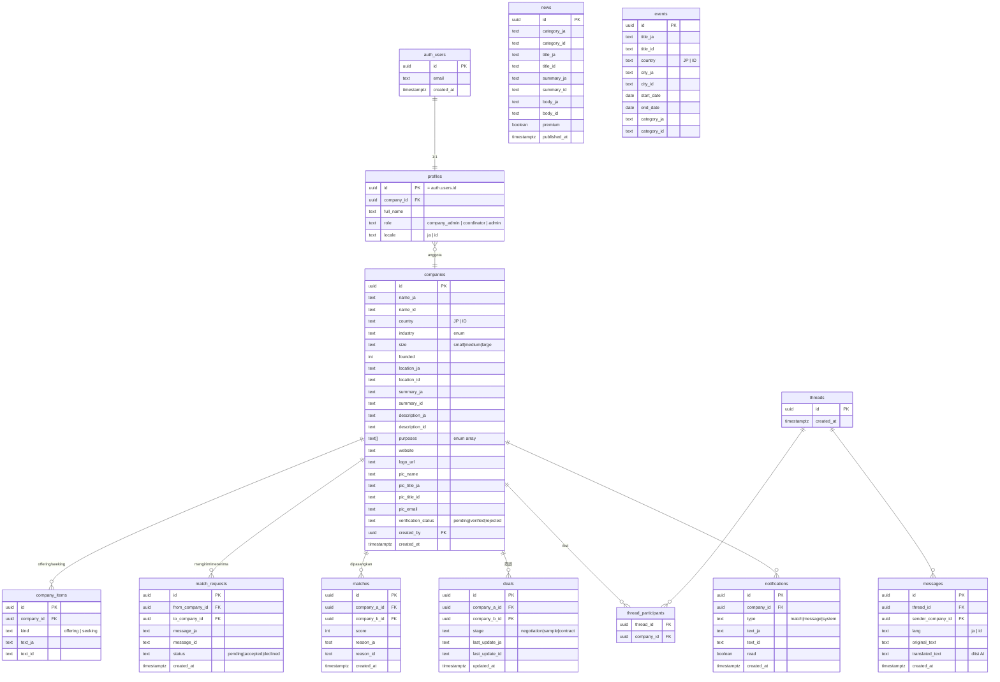

# Kakehashi — Desain Backend (untuk review)

> Status: **rancangan, belum diimplementasi.** Dokumen ini merancang skema database,
> arsitektur, dan perbandingan biaya. Tidak ada resource cloud yang dibuat.
> Semua angka biaya bersifat **perkiraan** — konfirmasi ke halaman pricing resmi
> tiap penyedia sebelum memutuskan (pricing berubah dari waktu ke waktu).

---

## 1. Ringkasan & rekomendasi

Front-end saat ini adalah SPA statis di GitHub Pages dengan data mock di `src/data/`.
Menambah backend berarti memindahkan data + logika ke layanan yang bisa menyimpan
state, mengautentikasi pengguna, dan menjalankan AI di sisi server.

**Rekomendasi: Supabase**, dibangun bertahap. Alasannya:
- Satu paket: **Postgres + Auth + Realtime + Storage + Edge Functions** — menutup
  semua kebutuhan Kakehashi tanpa merakit banyak layanan.
- **Front-end tetap di GitHub Pages** — SPA cukup memanggil Supabase lewat client JS.
  Tidak perlu pindah hosting front-end.
- Model data **relasional** cocok dengan domain kita (perusahaan ↔ match ↔ pesan
  ↔ deal), yang canggung di Firestore (NoSQL).
- Sudah jadi rencana di README fase berikutnya.

---

## 2. Perbandingan stack + biaya

| Aspek | **Supabase** (rekomendasi) | **Node + Express + Postgres** | **Firebase** |
|---|---|---|---|
| Model data | Postgres (relational) | Postgres (relational) | Firestore (NoSQL/dokumen) |
| Auth | Bawaan (email/pw, OAuth, sesi) | Rakit sendiri (Lucia/Passport/JWT) | Bawaan (bagus) |
| Realtime (chat) | Bawaan (Postgres changes) | Rakit (Socket.io) | Bawaan (bagus) |
| Storage (logo) | Bawaan (S3-compatible) | Rakit (S3/R2) | Bawaan |
| Server AI | Edge Functions (Deno) | Route Express sendiri | Cloud Functions |
| Kerja setup / ops | Rendah | Tinggi | Sedang |
| Hosting front-end | Tetap GitHub Pages | Tetap GitHub Pages | Firebase Hosting / Pages |

### Perkiraan biaya bulanan

**Supabase**
- **Free — $0**: cukup untuk review & pilot awal. ~500 MB DB, 1 GB storage,
  ~50rb pengguna auth, realtime & edge functions termasuk.
  ⚠️ **Catatan penting:** project free **di-pause otomatis setelah ~1 minggu tanpa
  aktivitas** — untuk demo yang jarang dibuka, ini mengganggu.
- **Pro — ~$25/bulan**: tidak ada auto-pause, backup harian, ~8 GB DB, 100 GB
  storage, headroom lebih besar. **Ini tier yang realistis begitu masuk pilot serius.**
- Kelebihan pemakaian ditagih per unit (storage ~$0.125/GB, bandwidth, dst.).

**Node + Express + Postgres (self-host)**
- Perlu **2 hosting**: server app + Postgres.
- Railway / Render / Fly.io: kira-kira **$5–20/bulan** untuk skala kecil
  (Render punya tier gratis tapi "tidur" saat idle → cold start; Postgres gratis
  Render hanya 90 hari lalu ~$7/bulan).
- Biaya termurah di uang, **termahal di waktu**: auth, realtime, storage semua
  dirakit manual.

**Firebase**
- **Spark (free) — $0**: Firestore ~1 GB, batas baca/tulis harian, Auth gratis,
  5 GB storage.
- **Blaze (pay-as-you-go)**: bayar per operasi (baca ~$0.06/100rb, tulis
  ~$0.18/100rb, dll.) → **bisa melonjak tak terduga** kalau traffic naik.
- Ganjalan utama: query relasional kita (filter lintas industri/tujuan/negara,
  join untuk match) tidak natural di Firestore.

**Lapisan AI — biaya API (hanya jika lanjut ke translation & matching)**
- Ini **satu-satunya biaya yang tumbuh mengikuti pemakaian**; sisanya tetap/rendah.
- Terjemahan chat & profil JP⇔ID: pakai model murah-cepat (mis. **Claude Haiku 4.5**).
  Satu pesan chat ~ratusan token → **pecahan sen per terjemahan**. Di volume rendah,
  realistis **beberapa dolar/bulan**.
- Matching (skor kecocokan): bisa embedding + reasoning; biaya kecil di skala pilot.
- Angka pasti per-token sebaiknya dikonfirmasi saat fase AI dimulai (saya bisa tarik
  referensi harga Anthropic terbaru saat itu).

### Kesimpulan biaya
| Fase | Biaya realistis |
|---|---|
| Review / pilot (Supabase Free, tanpa AI) | **$0** |
| Pilot serius (Supabase Pro, tanpa auto-pause + backup) | **~$25/bulan** |
| + AI translation & matching aktif | ~$25/bulan **+ pemakaian AI** (beberapa $/bulan di volume rendah) |

---

## 3. Skema database (Postgres / Supabase)

Menggantikan data mock. Label i18n (`meta.industries.*`, dll.) tetap di file i18n
front-end; database hanya menyimpan **kode enum**, bukan teks tampilan.



### Catatan desain
- **Enum**: `industry`, `purpose`, `company_size`, `country` sebagai enum Postgres
  (atau tabel lookup). Kode disimpan; label dwibahasa tetap di i18n front-end.
- **Kolom dwibahasa** (`*_ja` / `*_id`) mengikuti pola data mock sekarang → migrasi
  mulus.
- **`offering` / `seeking`**: dinormalisasi ke `company_items` (alternatif lebih
  ringkas: kolom `jsonb`). Rekomendasi tabel terpisah agar mudah di-query/edit.
- **`matches`** menggantikan `matchScore` per-viewer di mock → skor kini pasangan
  perusahaan (A↔B) yang dihitung AI, bukan atribut statis.
- **`news.premium`**: body lengkap hanya untuk member (lihat RLS di bawah).

---

## 4. Arsitektur & alur

```
[SPA React di GitHub Pages]
        │  supabase-js (anon key — aman dgn RLS)
        ▼
[Supabase]
  ├─ Auth ............ email/password, sesi
  ├─ Postgres ........ tabel di atas + Row Level Security
  ├─ Realtime ........ langganan perubahan tabel `messages` (chat)
  ├─ Storage ......... bucket `company-logos`
  └─ Edge Functions .. panggil API Anthropic (server-side)
        ├─ translate-message  (pesan baru → isi translated_text)
        └─ compute-matches    (profil berubah → hitung skor → isi `matches`)
```

- **Auth**: Supabase Auth menggantikan submit mock di `LoginPage`/`SignupPage`.
  (Catatan: app sekarang sengaja hindari `localStorage`; dengan auth asli, sesi
  Supabase memang perlu persistensi — batasan "no localStorage" itu khusus mock.)
- **Keamanan (RLS) — wajib**, karena anon key bersifat publik:
  - `companies`: yang `verified` bisa dibaca semua user login; record milik sendiri
    bisa diedit anggotanya; yang belum verified hanya pemilik + coordinator.
  - `messages`/`threads`: hanya peserta yang boleh baca/tulis.
  - `news`: ringkasan bebas; **body premium** hanya untuk member.
  - `match_requests`/`notifications`: hanya perusahaan tujuan.
  - Peran `coordinator`/`admin` (staf ANC) untuk screening/verifikasi.
- **Secrets**: API key Anthropic + service key Supabase **hanya di env Edge Function
  / Supabase secrets — TIDAK PERNAH di bundle front-end**. Anon key aman di publik.
- **Storage**: upload logo di `RegisterPage` → unggah nyata ke bucket, `logo_url`
  disimpan di `companies`.

---

## 5. Rencana implementasi bertahap

1. **Fondasi** (pilihan Anda tadi = mulai di sini): Auth asli + tabel `companies`
   (+ `company_items`, enum) + RLS. Seed dengan 15 perusahaan mock sekarang → UI
   terlihat sama tapi sudah dari DB. Ganti baca `src/data/companies.ts` dengan
   query Supabase di satu lapisan data-access.
2. **Interaksi**: `match_requests`, `matches`, `deals`, `notifications`, dashboard
   pakai data nyata.
3. **Chat realtime**: `threads` + `messages` + langganan Realtime.
4. **Konten**: `news` + `events` dari DB (admin bisa kelola).
5. **AI (biaya API mulai di sini)**: Edge Function `translate-message` &
   `compute-matches`.
6. **Screening**: panel coordinator ANC untuk verifikasi perusahaan.

---

## 6. Keputusan terbuka (butuh input Anda saat implementasi)

1. **Akun Supabase**: pakai akun/organisasi Anda yang mana? Provisioning (buat
   project) memakai akun Anda — saya konfirmasi dulu sebelum membuat apa pun.
2. **Free vs Pro**: mulai Free ($0, tapi auto-pause) atau langsung Pro (~$25/bln)?
3. **Persistensi sesi**: setuju memakai `localStorage` untuk sesi login asli?
   (menggantikan batasan mock)
4. **AI**: kapan mengaktifkan translation/matching (satu-satunya biaya berjalan)?
5. **Data mock → seed**: pertahankan 15 perusahaan contoh sebagai data awal, atau
   mulai kosong?
